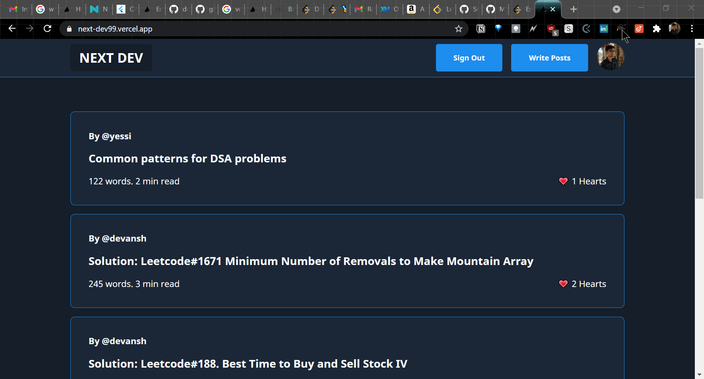

# Next Dev

Loosely inspired by Dev.to and Medium.

Improved web performance by making use of SSR, SSG, and ISR techniques.

Implemented Firestore CRUD and data modeling techniques.

[Live Demo](https://next-dev99.vercel.app/)

## Contributing to this project
<!--- If your README is long or you have some specific process or steps you want contributors to follow, consider creating a separate CONTRIBUTING.md file--->
To contribute to <project_name>, follow these steps:

1. Fork this repository.
2. Create a branch: `git checkout -b <branch_name>`.
3. Make your changes and commit them: `git commit -m '<commit_message>'`
4. Push to the original branch: `git push origin <project_name>/<location>`
5. Create the pull request.

Alternatively see the GitHub documentation on [creating a pull request](https://help.github.com/en/github/collaborating-with-issues-and-pull-requests/creating-a-pull-request).

## Contact

If you want to contact me you can reach me at 
